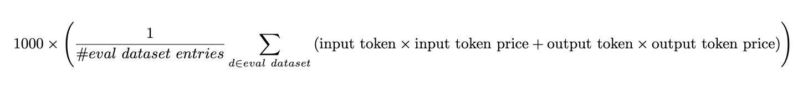

# Evals to make

## Math
[x] GSM8K

[x] MATH

## code
[ ] HumanEval

[ ] MBPP 

[ ] Natural2Code

[ ] MBPP (early)

[ ] SWE-bench

## commonsense reasoning
[ ] ARC (AI2 Reasoning Challenge)

[x] HellaSwag

[ ] Winogrande

[ ] PIQA

[ ] SIQA

[ ] OpenbookQA

[ ] CommonsenseQA

## Question Answering - world knowledge
[ ] WebQuestions

[ ] NaturalQuestions

[ ] TriviaQA

[ ] ComplexWebQuestions

[ ] WebQuestionsSP

[ ] SearchQA

[ ] HotpotQA

[ ] DROP

[ ] WikiHop

[ ] QAngaroo

[ ] Multi

[ ] GLUE (early)

[ ] SuperGLUE

## reading comprehension

[ ] BoolQ

[ ] QuAC

[ ] DROP

## aggregated

[x] MMLU [MMLU](https://en.wikipedia.org/wiki/MMLU) (https://arxiv.org/abs/2009.03300) (https://github.com/hendrycks/test) [Data] (https://people.eecs.berkeley.edu/~hendrycks/data.tar) [eval](https://github.com/hendrycks/test/blob/master/evaluate.py) [cite] ```@article{hendryckstest2021,
  title={Measuring Massive Multitask Language Understanding},
  author={Dan Hendrycks and Collin Burns and Steven Basart and Andy Zou and Mantas Mazeika and Dawn Song and Jacob Steinhardt},
  journal={Proceedings of the International Conference on Learning Representations (ICLR)},
  year={2021}
}

@article{hendrycks2021ethics,
  title={Aligning AI With Shared Human Values},
  author={Dan Hendrycks and Collin Burns and Steven Basart and Andrew Critch and Jerry Li and Dawn Song and Jacob Steinhardt},
  journal={Proceedings of the International Conference on Learning Representations (ICLR)},
  year={2021}
}```

[ ] HELM

[ ] BBH

[ ] AGI Eval 

## multi-agent

[ ] ChatBot Arena

[/] MT Bench


# Metrics

[ ] Task accomplished y/n

[ ] Task quality 1-5

[ ] was a tool used y/n
   [ ] which tool
   [ ] how was it used
   [ ] were tools called in the right order
   [ ] were the tools used correctly? Did the environment change?
   [ ] Did the agent output match the expected reference output?

[ ] Compute load

[ ] Cost $
   " the cost per 1000 function callings "

[ ] Average Latency (s)
    "Latency: we measure the latency by timing each request to the endpoint ignoring the function document preprocessing time."

[ ] Model size needed (Small, Medium, Large)
[ ] Model type needed (LM, VLM, predictive, point cloud, NeRF/Splat)
[ ] Number of trials to acceptable performance
[ ] Number of trials to best performance

# References

[1]Functional Benchmarks for Robust Evaluation of Reasoning Performance, and the Reasoning Gap (https://arxiv.org/html/2402.19450v1) Code (https://github.com/consequentai/fneval/)

[2]explanation of metrics (https://gorilla.cs.berkeley.edu/blogs/8_berkeley_function_calling_leaderboard.html)

[3] tool use benchmarks (https://langchain-ai.github.io/langchain-benchmarks/notebooks/tool_usage/intro.html?ref=blog.langchain.dev) (https://blog.langchain.dev/benchmarking-agent-tool-use/)

[4] Blog on evaluating LLM apps (https://humanloop.com/blog/evaluating-llm-apps)